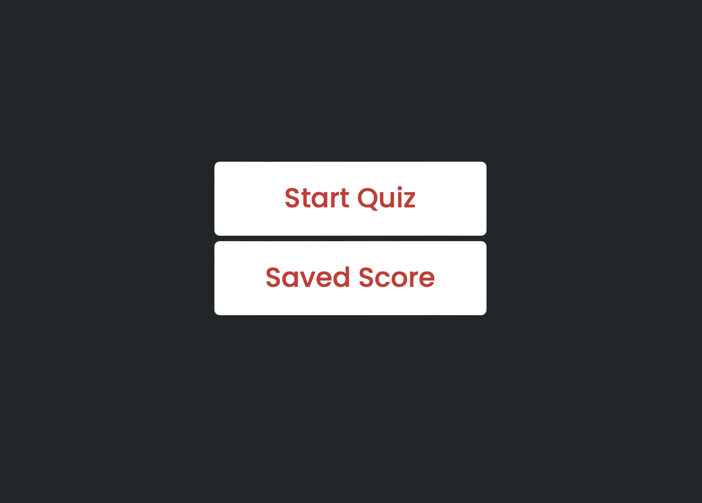
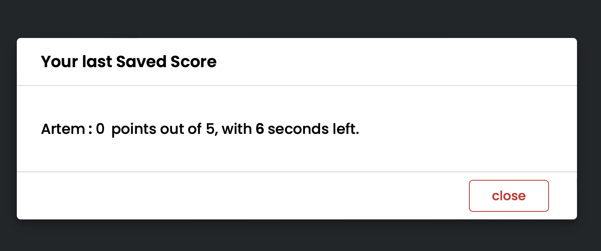
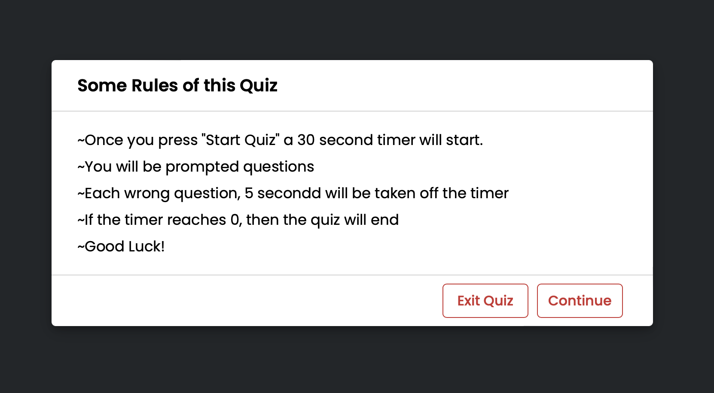
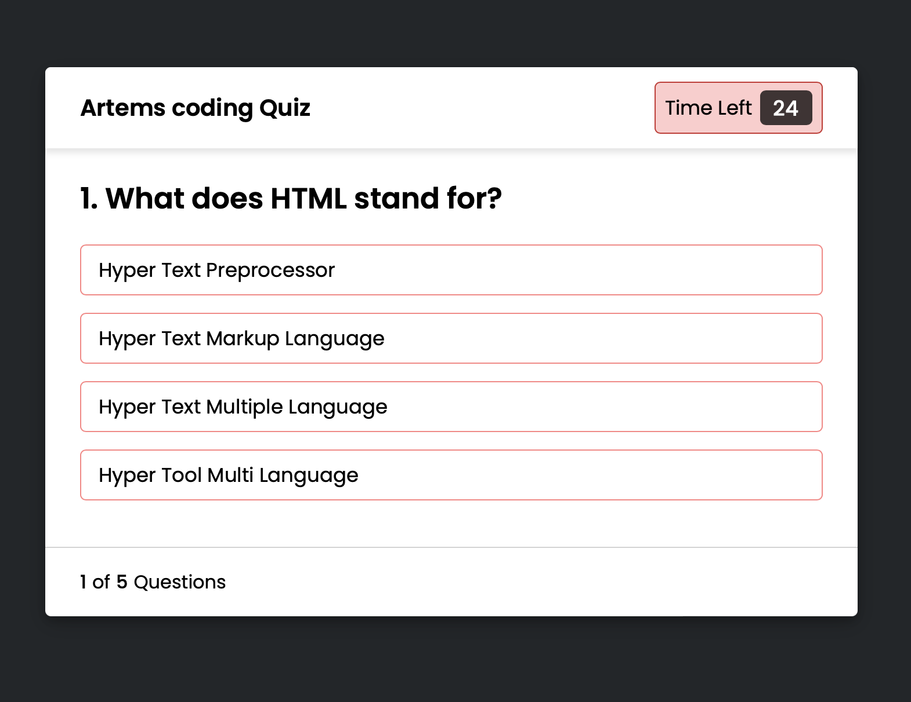
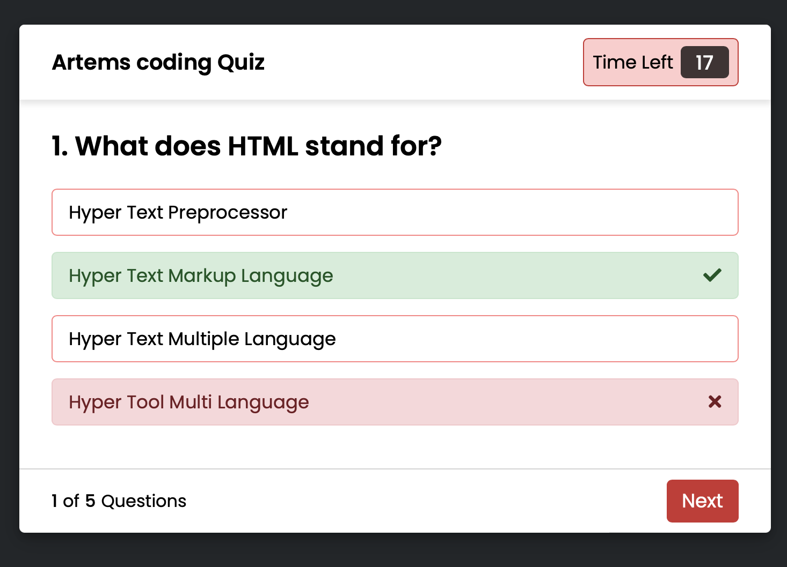
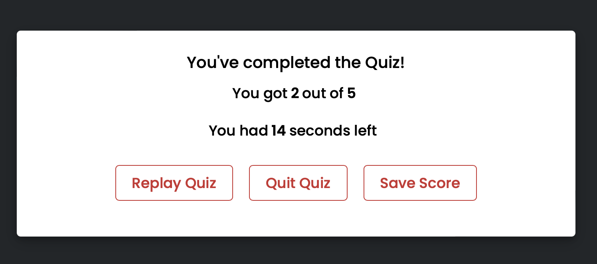
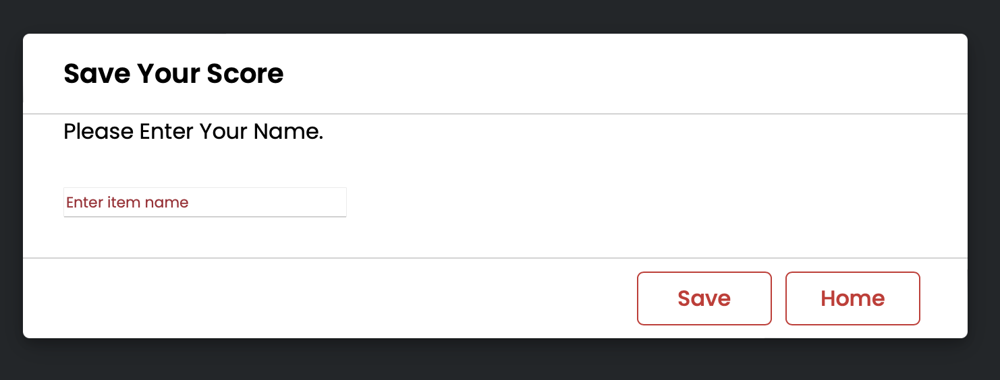
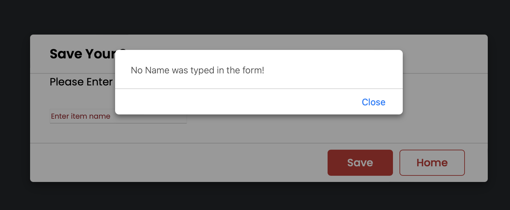

# Coding_Quiz
    This porject used html, javascript, and css. I used html to creat different 
    containers to show different parts on the screen. I have two javascrip files.
    One was used to create functions and make the buttons work. The other file
    was used to set up the questions, answers, and options. The user will interact
    with html while java will be changing everything on the screen.
    

    When the webpage is loadded 
    you will be presented with tow buttoms "Start Quiz" and "Saved Score".

    If you select "Saved Score" then you will be presented with a page of the
    last saved score. This score was saved to local storage. you will have an
    option to close clean and it will take you back to the 2 buttons.

    If the "Start Quiz" option was clicked on then you will be taken to the 
    instrutions page.

    From here you have the option to either contiue and start the quiz or
    to quit and it will take you bakc to the two buttons. If the continue 
    button is clicked then the quiz will start.

    Once you make a selection then it will tell you if you got it correct or
    not, then you will have the option to go to the next question.

    When the quiz is over, either time runs out or you finish all the qutions
    the you will be shown your score, you will have the option to restart the 
    quiz, quit and go to begining, or to save the score.

    If you chose to save your score then you will be taken to next page where
    you can type your name to save your score with you name. Once you hit submit
    then it will be save to local storage.

    If no name was typed and you pressed save then you will be given an alert
    saying that no name was typed. You can close the alert and try again.

URL: https://artemk2002.github.io/Coding_Quiz/
    
    
